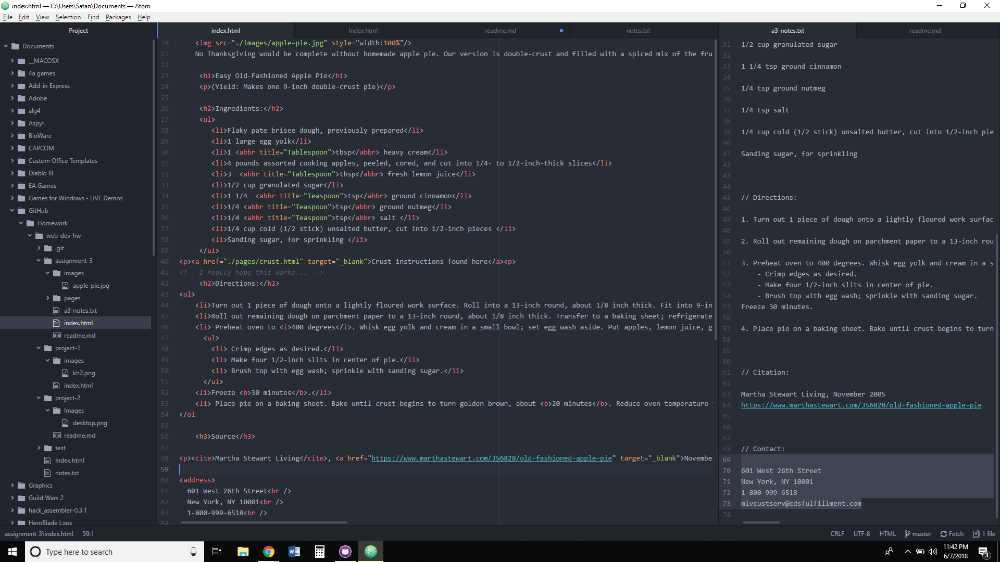

#Assignment 3 questions

- How many <head> and <body> elements can a page have? How are these elements different, or what role do they play?

I've been trying to find this in the readings and on the website, but I can't seem to find where it is stated. I attempted to recreate this scenario in my https://thelastkeyblademaster.github.io/web-dev-hw/test/check.html page and didn't get any conclusive result back, so I'm going to say that you can only have 1 head and 1 body. You can technically have more, but it doesn't look like html will count the other ones.

- Describe the difference between structural and semantic markup.

Structural markups help shape the physical structure of the overall page. They help guide the reader through the page, and help to organize it.

Semantic markups help emphasize the meanings of the information within a document. They help give the page an accent, and allow for additional information and tools to be presented to the user.

- Summarize your work cycle for this assignment. Review this page if you need some ideas.

I put it off for a while so I could focus on my Photoshop class. I finally finished the class and am ready to punch through this class, but I'm leaving for a bit. Thankfully, this class has a nice grace period, which I am very thankful for! After I read through the assignment I was able to put the website together like the recipe itself. It could have been in a nicer order, but in the end everything turned out well!

- Embed a screenshot of your workspace at some point during your development cycle.

