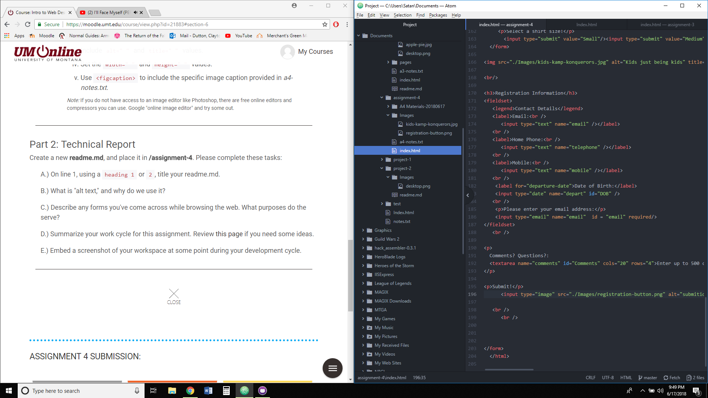

#Assignment 4 Questions

What is "alt text," and why do we use it?

Alt text is used in the alt attribute of images. It provides a text description of the image to make it easier for search engines and other screen reader software to locate. It can also provide additional information to the user.

Describe any forms you've come across while browsing the web. What purposes do the serve?

Forms that I run into are mostly used for gathering information. Whether it's a poll, and application, or account creation/verification, most websites have some kind of form attached to them to help them gather information.

Summarize your work cycle for this assignment. Review this page if you need some ideas.

Well, I mostly did it in an airport during a layover in Denver, so... I dunno? I read the requirements and when I came across what was asked in the readings I put in the work.

 Embed a screenshot of your workspace at some point during your development cycle.

