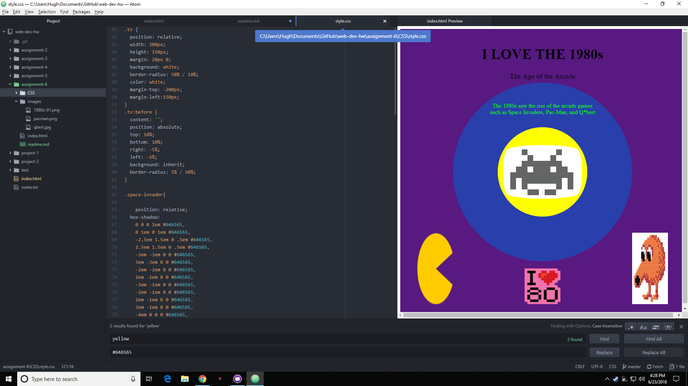

#Assignment 6 Read Me

##Briefly share your design research for this assignment. What graphic or graphics did you choose, from what decade? How did you try to style your "art page" to reflect your exploration of this decade's design trends?

I chose to incorporate a theme of an arcade, as I have a strong passion for videogames. I chose to use characters from popular arcade games from the 80's, and designed the image to look like a screen with a game playing on it. I included images that might be found on the side of such an arcade machine, and had text above the image, as is common with arcade machines.  

##Describe your color palette, including the 3 colors you chose. List their color names, rgb values, or hex codes.

In my research I found that the most common 80's color pallet was blue(41, 63, 172), purple(88, 25, 129), and yellow(240, 255, 0). I chose to use these colors on circles as these were a common design.  

##Summarize your work cycle for this assignment. Review this page if you need some ideas.

I had a really hard time understanding how shapes worked, and I still don't really understand them. I found a website that had a couple of cool shapes that were free to use, so I took advantage of that. Nesting was also a bit of a problem. I didn't realize that some of my items were nested, so I decided to just leave them and work around it. 

##Embed a screenshot of your workspace at some point during your development cycle.

