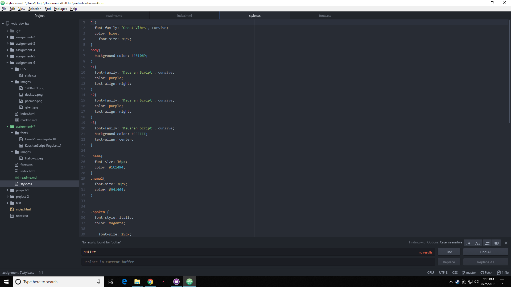

#Assignment-7 readme.md

##Briefly share your design process for this assignment. What fonts did you choose, and why?

I chose a style that made the text look handwritten. When I saw the primary font I imaged it to look like what Dumbledore's handwriting is supposed to look like, so I assumed it would be an appropriate font styling. I chose the colors out of a purple pallet, as purple is one of the more commonly used colors in the series to represent magic.  

##What is the difference between a system font, web font, and web-safe font? What is the importance of having fallback fonts or a font stack?

System fonts are hosted on the computer, web fonts are hosted on a server, and web-safe fonts are universally found fonts, meaning that it can safely be assumed that every computer has this. The importance in having fallback fonts or font stacks is to be able to display your text in case your text ends up failing to be displayed due to server or incompatibility issues.

##Summarize your work cycle for this assignment. Review this page if you need some ideas.

I had a really hard time understanding the concept of importing the font stylings for some reason, but as I fell asleep last night it clicked. I was over-thinking it, and after I understood it I was able to breeze through this assignment. 

##Embed a screenshot of your workspace at some point during your development cycle.

