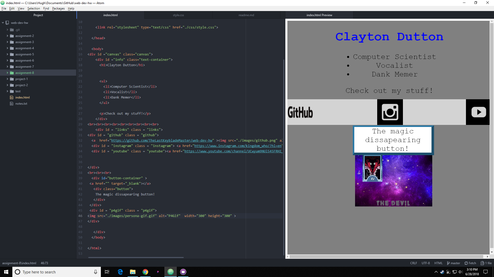

#Assignment-8 readme.md

##What is the difference between padding, margin, and borders?

Padding: The space you can add or subtract between the outer piece of an element, and the content.

Margin: the space between elements.

Borders: Define the amount of space an element will take up.

##What was the hardest task for you to accomplish this assignment? For example, was it overlapping elements, working with sizing, creating layout, or something else entirely?

Understanding and implementing the Z-index. For some reason when I added it to the site none of the buttons worked, and after some tinkering it randomly started working. I'm not sure why, I didn't do anything differently. I'm going to assume it was a weird glitch.

##Summarize your work cycle for this assignment. Review this page if you need some ideas.

I honestly misunderstood this assignment, I thought we would be getting content from you and have to fix it. Then I read through it again and realized I had to do it all so I got to work. I used a lot of the code we used before hand to streamline this process, but not being able to see what I'm working on in real-time is kind of a pain. I have a plugin that shows me a general image, but it has an issue showing exact spacing, so I had to make a lot of adjustments on the fly. I would have liked more time on this assignment, but to my understanding it is due tonight, and the class has already been extended so I don't really have time.

##Embed a screenshot of your workspace at some point during your development cycle.

