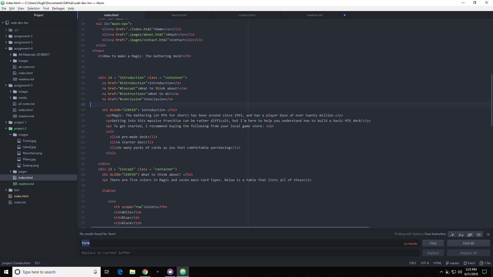

#Project-2 readme

Briefly recap your experience learning HTML. What was old, new, interesting, or difficult to learn?

I already knew a bit about HTML. This is my third class related to website design, but the other classes I had taken were from the computer science department, and focused more on the backend of development. This was a little easier in comparison, and I wish I had taken this first, as I had to learn backend coding while learning basic HTML.

Next Topic we begin CSS and expand on styling, which helps us "decorate" HTML. Is there anything you're anxious or excited to learn about in this new section?

Like HTML I do have a bit of experience with CSS. I look forward to learning more about gif image incorporation, and fine tuning my CSS skillset.

Summarize your work cycle for this assignment. Review this page if you need some ideas.

This one I had to split up into a few days worth of work. Finally got it done though. Same as usual, material and project read, used the tools as they came up.

Embed a screenshot of your workspace at some point during your development cycle.

