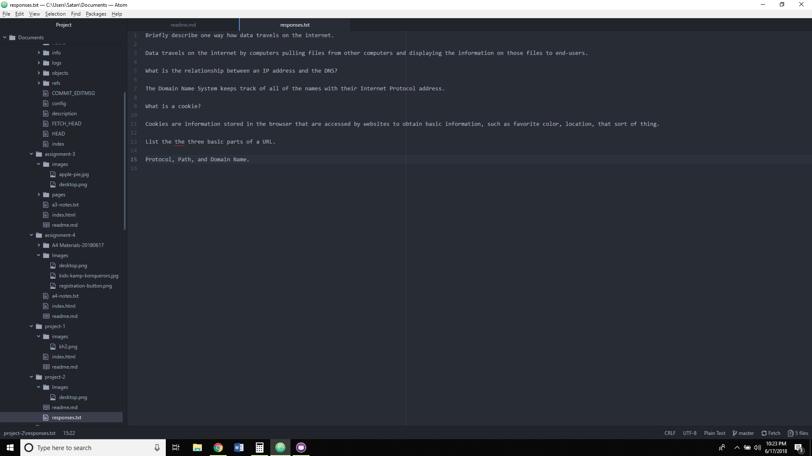

#Assignment 2
##questions and answers

In a paragraph, describe what a Version Control System is, and why we're using one in this class.

A Version Control System allows one or more users to edit files and keep track of changes to the files. It allows users to see what has changed over time, what files used to be like, and even allows users to bring back these older file versions. This is useful if multiple parties are editing a file, allows for recovery of lost data, and, if something breaks, allows the users to more easily location the cause of the break. 

After completing "responses.txt," link to it in your /assignment-2/readme.md using its relative URL.  

[Responses to questions for project-2](./responses.txt)

Briefly share your work cycle for this assignment. Review this page if you need some ideas.

I apparently missed this assignment. After figuring everything out it was a breeze. I had already created my repository, I just missed these questions and such. I did the readings and then, a while later, answered the questions.

